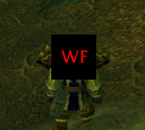

WfReminder - Shaman's weapon imbue tracker addon, made by Gruks

How it looks like:

At start please note that while I'm a coder for 13years (that's paid time only),
this is first time I've made an addon for WoW, mainly asking ChatGPT for things.

So while I can use common sense if things from code will work or not,
I can't guarantee that this is done in an optimal way.

The purpose of this addon is to never again raid without Windfury turned on.

Addon checks every 5 seconds if you have a weapon imbue, 
if not - it will display a black square with red "WF" text in the middle of your screen (so on your character).
After casting WF - it will update within next 5 seconds.

This doesn't check what weapon imbue you have, so the "sqare" will not be displayed if you have ANY imbue, so:
- Flametongue
- Rockbiter
- Frostbrand
- and ofc Windfury

Feel free to clone this repo and do some changes, you can also contact me via discord - Grukz#3697
